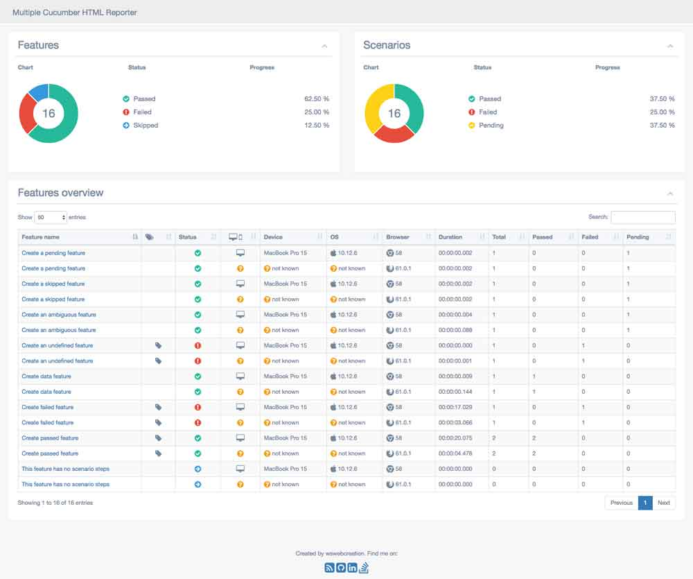
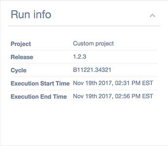
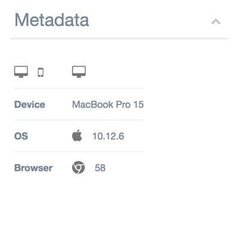

# wdio-multiple-cucumber-html-reporter
A WebdriverIO reporter plugin. Reporter that creates beautiful Cucumber HTML reports by using [multiple-cucumber-html-reporter](https://github.com/wswebcreation/multiple-cucumber-html-reporter)

> **THIS REPORTER IS STILL UNDER DEVELOPMENT, FEEL FREE TO ADD PR'S**

> **THIS REPORTER NEEDS TO USE `wdio-cucumber-framework` OR HIGHER, SEE FAQ'S**

## What does it do?
This reporter does two things

1. First of all it creates a CucumberJS-JSON file. This is needed because the BaseReporter of webdriver.io overwrites the CucumberJS report output
2. Based on the created JSON it creates a HTML-report like below



> Not all options / data that is provided in [multiple-cucumber-html-reporter](https://github.com/wswebcreation/multiple-cucumber-html-reporter) can be used due to limitations in the generated JSON file by this reporter


## Installation
The easiest way is to keep `wdio-multiple-cucumber-html-reporter` as a devDependency in your `package.json`.

```json
{
  "devDependencies": {
    "wdio-multiple-cucumber-html-reporter": "~0.1.0"
  }
}
```

You can simple do it by:

```bash
npm install wdio-multiple-cucumber-html-reporter --save-dev
```

so it will be added automatically to your `package.json`

Instructions on how to install `WebdriverIO` can be found [here](http://webdriver.io/guide/getstarted/install.html).

## Configuration
Configure the output directory in your wdio.conf.js file:

```js
exports.config = {
    // ...
    reporters: ['multiple-cucumber-html-reporter'],
    reporterOptions: {
        htmlReporter: {
            jsonFolder: './tmp',
            reportFolder: `./tmp/report`,
            // ... other options, see Options
        }
    },
  // ...
}
```

## Options
### `jsonFolder`
- **Type:** `String`
- **Mandatory:** Yes

The directory where the JSON file, generated by this report, will be stored, relative from where the script is started.

**N.B.:** If you use a npm script from the command line, like for example `npm run test` the `jsonFolder` will be relative from the path where the script is executed. Executing it from the root of your project will also create the `jsonFolder` in the root of you project.

### `reportFolder`
- **Type:** `String`
- **Mandatory:** Yes

The directory in which the report needs to be saved, relative from where the script is started.

**N.B.:** If you use a npm script from the command line, like for example `npm run test` the `reportFolder` will be relative from the path where the script is executed. Executing it from the root of your project will also save the report in the `reportFolder` in the root of you project.

### `openReportInBrowser`
- **Type:** `boolean`
- **Mandatory:** No

If true the report will automatically be opened in the default browser of the operating system.

### `saveCollectedJSON`
- **Type:** `boolean`
- **Mandatory:** No

This reporter will first get the JSON-file and then enrich it with data that is used for the report. If `saveCollectedJSON :true` the JSON **AND** the enriched JSON will be saved in the `reportFolder`. They will be saved as:

- `merged-output.json`
- `enriched-output.json`

### `disableLog`
- **Type:** `boolean`
- **Mandatory:** No
- **Default:** `false`

This will disable the log so will **NOT** see this.

```shell
=====================================================================================
    Multiple Cucumber HTML report generated in:

    /Users/wswebcreation/multiple-cucumber-html-reporter/.tmp/index.html
========================================================================
```
### `pageTitle`
- **Type:** `string`
- **Mandatory:** No
- **Default:** Multiple Cucumber HTML Reporter

You can change the report title in the HTML head Tag

### `reportName`
- **Type:** `string`
- **Mandatory:** No

You can change the report name to a name you want

### `pageFooter`
- **Type:** `string`
- **Mandatory:** No

You can customise Page Footer if required. You just need to provide a html string like `<div><p>A custom footer in html</p></div>`

### `displayDuration`
- **Type:** `boolean`
- **Mandatory:** No

If set to `true` the duration of steps, scenarios and features is displayed on the Features overview and single feature page in an easily readable format.
This expects the durations in the report to be in **nanoseconds**, which might result in incorrect durations when using a version of Cucumber(JS 2 and 3) that does not report in nanoseconds but in milliseconds. This can be changed to milliseconds by adding the parameter `durationInMS: true`, see below

> **NOTE: Only the duration of a feature can be shown in the features overview. A total duration over all features CAN NOT be given because the module doesn't know if all features have been run in parallel**

### `customStyle`
- **Type:** `path`
- **Mandatory:** No

If you need add some custom style to your report. Add it like this `customStyle: 'your-path-where/custom.css'`

### `overrideStyle`
- **Type:** `path`
- **Mandatory:** No

If you need replace default style for your report. Add it like this `overrideStyle: 'your-path-where/custom.css'`

### `metadata`
- **Type:** `JSON`
- **Mandatory:** No

Print more data to your report, such as browser name + version, platform name + version and your environment. The values need to meet some predefined data, see [Metadata](./README.MD#metadata) for more info.
Data can be passed like below.

> **If you provide the metadata when instantiating `multi-cucumber-html-reporter` the metadata will be added to each feature. If you already have metadata in your JSON then the metadata in the JSON will take precedence**

```js
metadata:{
    browser: {
        name: 'chrome',
        version: '60'
    },
    device: 'Local test machine',
    platform: {
        name: 'ubuntu',
        version: '16.04'
    }
}
```

See [metadata](./README.MD#metadata-1) for more info

### `customData`
- **Type:** `object`
- **Mandatory:** No

You can add a custom data block to the report like this



```js
customData: {
    title: 'Run info',
    data: [
        {label: 'Project', value: 'Custom project'},
        {label: 'Release', value: '1.2.3'},
        {label: 'Cycle', value: 'B11221.34321'},
        {label: 'Execution Start Time', value: 'Nov 19th 2017, 02:31 PM EST'},
        {label: 'Execution End Time', value: 'Nov 19th 2017, 02:56 PM EST'}
    ]
}
```

#### `customData.title`
- **Type:** `string`
- **Mandatory:** No
- **Default:** `Custom data title`

Select a title for the custom data block. If not provided it will be defaulted.

#### `customData.data`
- **Type:** `array`
- **Mandatory:** yes

The data you want to add. This needs to be in the format

```js
data: [
    {label: 'your label', value: 'the represented value'}
]
```

## Metadata
The report can also show on which browser / device a feature has been executed. It is shown on the features overview in the table, like this

as well as on the feature overview in the container, like this


You can add this by adding the following object to your `capabilities`;

```js
exports.config = {
    //..
    capabilities: [
        {
            browserName: 'chrome',
            // Add this
            metadata: {
                browser: {
                    name: 'chrome',
                    version: '58'
                },
                device: 'MacBook Pro 15',
                platform: {
                    name: 'OSX',
                    version: '10.12.6'
                }
            },
        },
    ],
};
```

See the metadata information [here](https://github.com/wswebcreation/multiple-cucumber-html-reporter#metadatabrowsername) for the correct values.

> If you don't provide the `browser`-object in the metadata, this module will automatically determine it for you

> If you don't provide the `device` and or the `platform`-object it will be defaulted for you to `not known`

> If you don't provide a `browser.name` or a `browser.version` the module will try to determine this automatically. The rest will be shown as questionmarks in the report

## FAQ's

### I don't see the keywords `Given, When, Then` in the report
The module `wdio-cucumber-framework` only provides this information from version `2.2.0` and higher. Please upgrade to that version.

### `skipped` steps are marked as `pending`
`skipped` steps are currently marked as `pending` because `wdio-cucumber-framework` can't distinguish them, there is a PR for this, see [here](https://github.com/webdriverio/wdio-cucumber-framework/pull/34)

### `ambiguous` steps are marked as `pending`
CucumberJS has a status called `ambiguous`, this should also be shown in the report.
Because `wdio-cucumber-framework` has it's own implementation to handle ambiguous steps , see [here](https://github.com/webdriverio/wdio-cucumber-framework#failambiguousdefinitions)
it will not show the correct status in the report using this module.

### `undefined` steps are not marked as `undefined`
CucumberJS has a status called `undefined`, this should also be shown in the report.
Because `wdio-cucumber-framework` has it's own implementation to handle undefined steps , see [here](https://github.com/webdriverio/wdio-cucumber-framework#ignoreundefineddefinitions)
it will not show the correct status in the report using this module.

## Changelog
A changelog can be found [here](./docs/CHANGELOG.md).

## Contributing
How to contribute can be found [here](./docs/CONTRIBUTING.md).

## TODO:
### high priority
Needs to be in the first beta
- [x] Add `Before`-step to the json, see the remarks about the Before steps
- [x] Add `After`-step to the json, see the remarks about the After steps
- [x] Add browser data to the report, first start with the default capabilities
- [x] Add screenshots to the report
- [x] Add multiple screenshots to the report in 1 step
- [x] Test in multiple browsers in parallel
- [x] Check / add `Passed` status
- [x] Check / add `Failed` status
- [x] Check / add `Pending` status
- [x] Check / add `Ambiguous` status
- [x] Check / add `Skipped` status
- [x] Check / add `undefined` status

### low priority
Needs to be in, but are not mandatory
- [ ] Investigate `Hooks` and if they can influence the outcome
- [ ] Write UT's
- [ ] Test on Windows
- [ ] Test on Android
- [ ] Test on iOS

### research
- [x] Find out where the keywords are, there is no `Given, When, Then` comming back from webdriver.io => => Created a PR for [wdio-cucumber-framework 136](https://github.com/webdriverio/wdio-cucumber-framework/pull/136) that has been merged and released as version `2.2.0`
- [x] Add data tables to the report, see [data tables](https://github.com/cucumber/cucumber-js/blob/master/features/data_tables.feature) => Created a PR for [wdio-cucumber-framework 136](https://github.com/webdriverio/wdio-cucumber-framework/pull/136) that has been merged and released as version `2.2.0`
- [ ] Find out where the description of the feature is. Can't find it in the methods and it will not be added to the report then

## Some remarks
### Before hooks
Investigate how this works
#### Pass
Not logged in `wdio-cucumberjs-framework` => not in this module
#### Failed
Automatically logged by my implementation, not all data is logged like screenshots and so on

#### Pending
Pending state will result in the following:
- Beforehook will not get the status, there is only a start, not a pass/failed/pending
- All Scenario steps will get status pending
Meaning I can't log this

### After hooks
Investigate how this works
#### Pass
Not logged in `wdio-cucumberjs-framework` => not in this module
#### Failed
Automatically logged by my implementation, not all data is logged like screenshots and so on

#### Pending
Status pending of the After hook has no effect on the status of the report / wdio-cucumber-framework will not report this status
